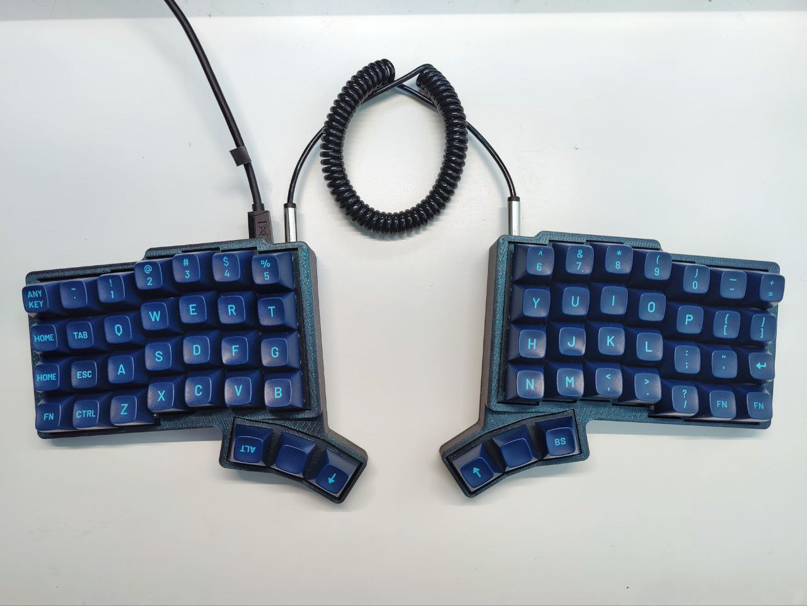
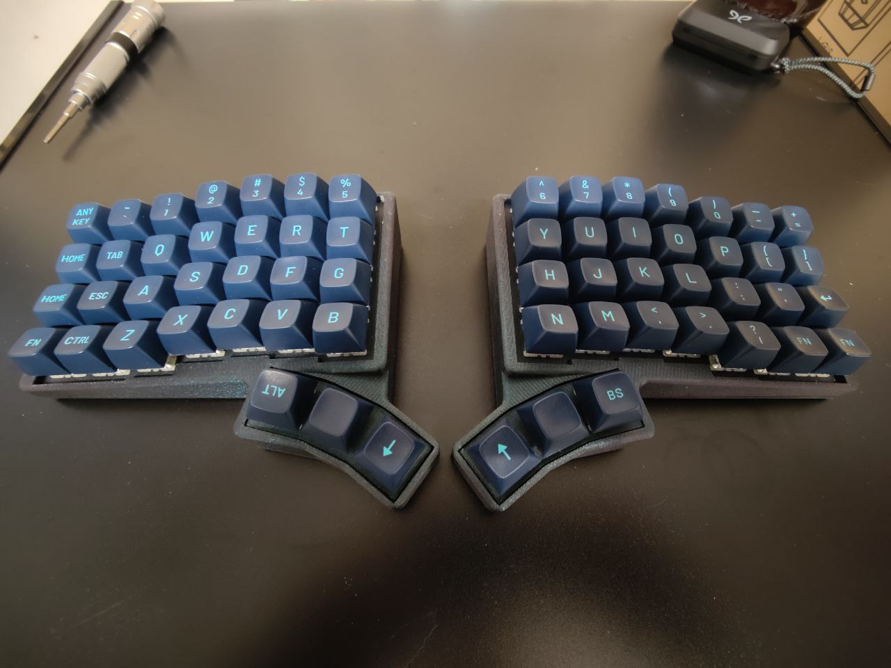
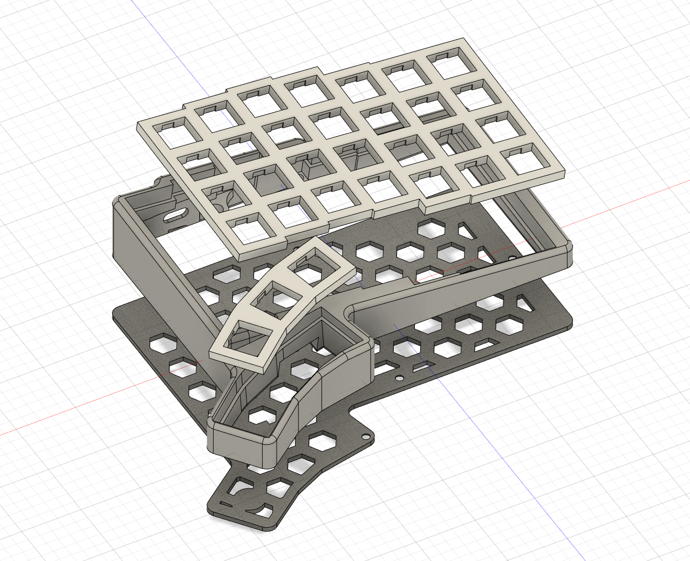

# "Irpin Board"

Ortho Column-staggered Handwired Split Keyboard 4x7+3 with light tilts.

The board designed for a friend of mine from Irpin, Ukraine, who tried very hard to get acquainted with Dactyl Manuform form factors, but couldn't.
As a result he ended up with _something flat but split and with many keys and having thumbs used not just for banging the spacebar_.

The board is using previous version of Pro Micro holder PCB from Bastdardkb's product line (https://github.com/Bastardkb/Elite-C-holder/tree/1.46), but it's not neccessary. 
Instead you can use the mounting plate from here: https://github.com/Bastardkb/Skeletyl/blob/main/things/pro%20micro%20mount%20plate/pro%20micro%20mount%20plate%20v2.stl 
The only reason I used it - I had lots of those PCBs lying around :)

## License

This work is licensed under a Creative Commons Attribution-NonCommercial-ShareAlike 4.0 International License.